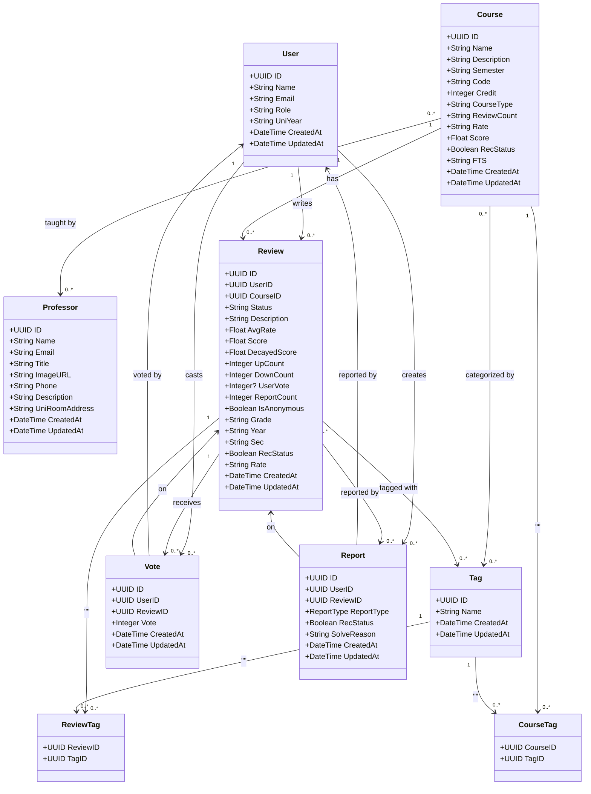

# Class Diagram - Real Course Review Backend

---

## Entity Descriptions

### User
- ผู้ใช้งานในระบบ (นักศึกษา/ผู้ดูแลระบบ)
- สามารถเขียนรีวิว, โหวต, และรายงานรีวิวได้
- มี Role สำหรับแยกสิทธิ์ (USER, ADMIN)

### Course
- รายวิชาในระบบ
- มีข้อมูล Code, Credit, Semester, CourseType
- คำนวณคะแนนเฉลี่ย (Rate) และจำนวนรีวิว (ReviewCount)
- มีสถานะการแนะนำวิชา (RecStatus)
- มี Full Text Search (FTS) สำหรับการค้นหา

### Professor
- อาจารย์ผู้สอน
- มีข้อมูลติดต่อและที่ตั้งห้องทำงาน
- สอนได้หลายวิชา (Many-to-Many กับ Course)

### Review
- รีวิวของวิชาที่เขียนโดยผู้ใช้
- มีคะแนนเฉลี่ย (AvgRate) จาก Rate (Happiness, Easiness, Quality)
- มีระบบ Vote (UpCount, DownCount, UserVote)
- รองรับคะแนนที่ใช้จัดอันดับตามเวลา (DecayedScore)
- สามารถตั้งค่าเป็นไม่เปิดเผยตัวตน (IsAnonymous)
- มีสถานะเนื้อหา (publish, ban, delete, hidden) และสถานะการแนะนำ (RecStatus)

### Tag
- แท็กสำหรับจัดหมวดหมู่ Course และ Review
- ใช้ Many-to-Many relationship

### Vote
- การโหวตรีวิว (Upvote = 1, Downvote = -1)
- ผู้ใช้หนึ่งคนสามารถโหวตรีวิวหนึ่งรีวิวได้เพียงครั้งเดียว

### Report
- การรายงานรีวิวที่ไม่เหมาะสม
- มี ReportType เพื่อระบุประเภทการรายงาน (1-4)
- มีสถานะการจัดการรายงาน (RecStatus) และเหตุผลการปิดรายงาน (SolveReason)

### Junction Tables
- **CourseTag**: เชื่อม Course กับ Tag (Many-to-Many)
- **ReviewTag**: เชื่อม Review กับ Tag (Many-to-Many)

---

## Relationships Summary

| From | Relationship | To | Description |
|------|-------------|-----|-------------|
| User | 1 : N | Review | ผู้ใช้เขียนได้หลายรีวิว |
| User | 1 : N | Vote | ผู้ใช้โหวตได้หลายรีวิว |
| User | 1 : N | Report | ผู้ใช้รายงานได้หลายรีวิว |
| Course | 1 : N | Review | วิชามีได้หลายรีวิว |
| Course | N : M | Professor | วิชาสอนโดยหลายอาจารย์ |
| Course | N : M | Tag | วิชามีได้หลายแท็ก |
| Review | 1 : N | Vote | รีวิวได้รับหลายโหวต |
| Review | 1 : N | Report | รีวิวถูกรายงานได้หลายครั้ง |
| Review | N : M | Tag | รีวิวมีได้หลายแท็ก |
