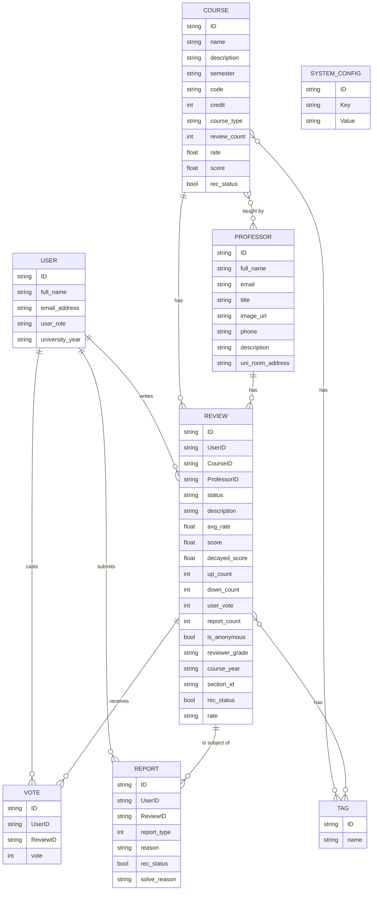

```mermaid
erDiagram
    USER {
        string ID
        string full_name
        string email_address
        string user_role
        string university_year
    }

    REVIEW {
        string ID
        string UserID
        string CourseID
        string ProfessorID
        string status
        string description
        float avg_rate
        float score
        float decayed_score
        int up_count
        int down_count
        int user_vote
        int report_count
        bool is_anonymous
        string reviewer_grade
        string course_year
        string section_id
        bool rec_status
        string rate
    }

    COURSE {
        string ID
        string name
        string description
        string semester
        string code
        int credit
        string course_type
        int review_count
        float rate
        float score
        bool rec_status
    }

    PROFESSOR {
        string ID
        string full_name
        string email
        string title
        string image_url
        string phone
        string description
        string uni_room_address
    }

    VOTE {
        string ID
        string UserID
        string ReviewID
        int vote
    }

    TAG {
        string ID
        string name
    }

    REPORT {
        string ID
        string UserID
        string ReviewID
        int report_type
        string reason
        bool rec_status
        string solve_reason
    }

    SYSTEM_CONFIG {
        string ID
        string Key
        string Value
    }

    USER ||--o{ REVIEW : "writes"
    USER ||--o{ VOTE : "casts"
    USER ||--o{ REPORT : "submits"

    COURSE ||--o{ REVIEW : "has"
    PROFESSOR ||--o{ REVIEW : "has"

    REVIEW ||--o{ VOTE : "receives"
    REVIEW ||--o{ REPORT : "is subject of"

    COURSE }o--o{ PROFESSOR : "taught by"
    COURSE }o--o{ TAG : "has"
    REVIEW }o--o{ TAG : "has"
```
