# Sequence Diagrams - Real Course Review Backend

## 1. Auth Flow - Login/Register
**หน้าบ้าน:** Login Page

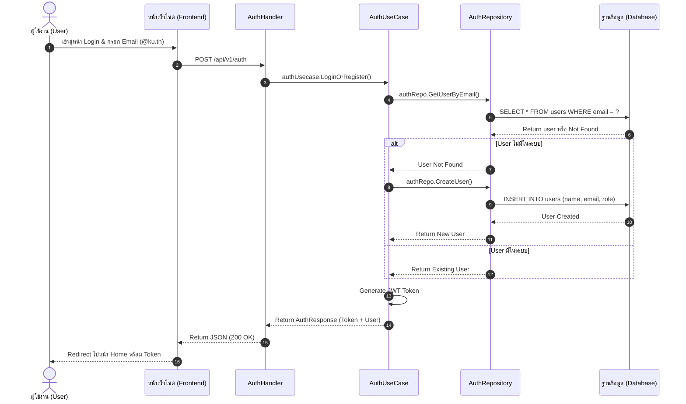

---

## 2. Course Flow - Get All Courses
**หน้าบ้าน:** Home Page

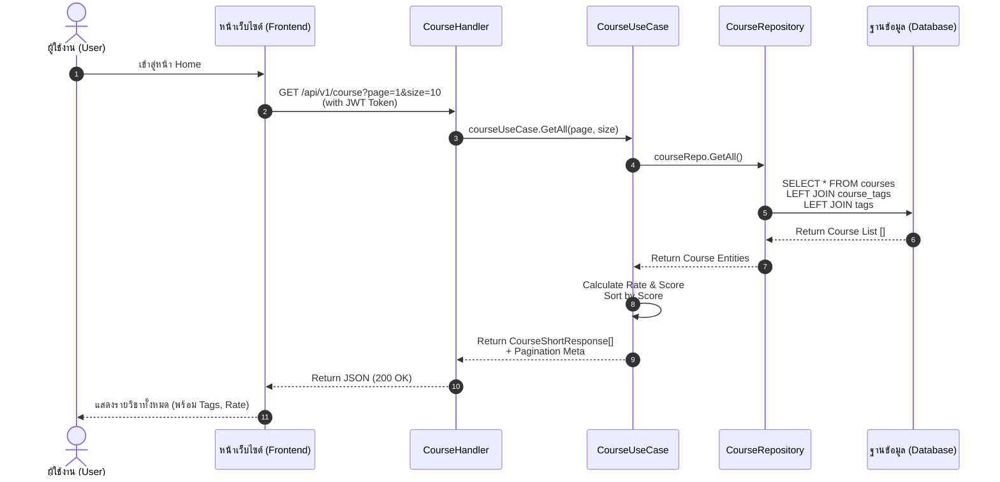

---

## 3. Course Flow - Search Courses
**หน้าบ้าน:** Home Page

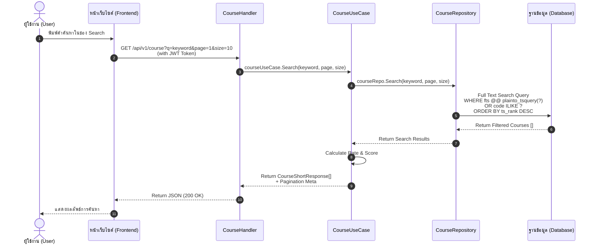

---

## 4. Course Flow - Get Course By ID
**หน้าบ้าน:** Course Detail Page

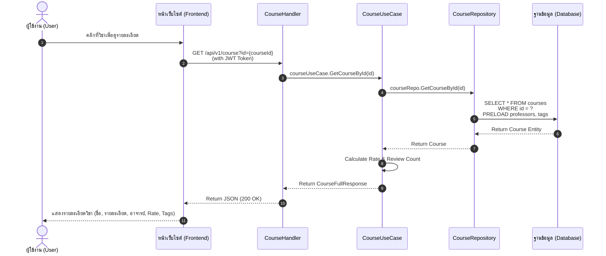

---

## 5. Course Flow - Compare Courses
**หน้าบ้าน:** Compare Page

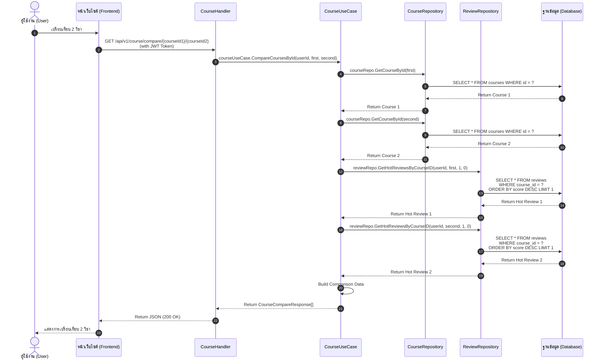

---

## 6. Review Flow - Get Reviews by Course ID
**หน้าบ้าน:** Course Detail Page

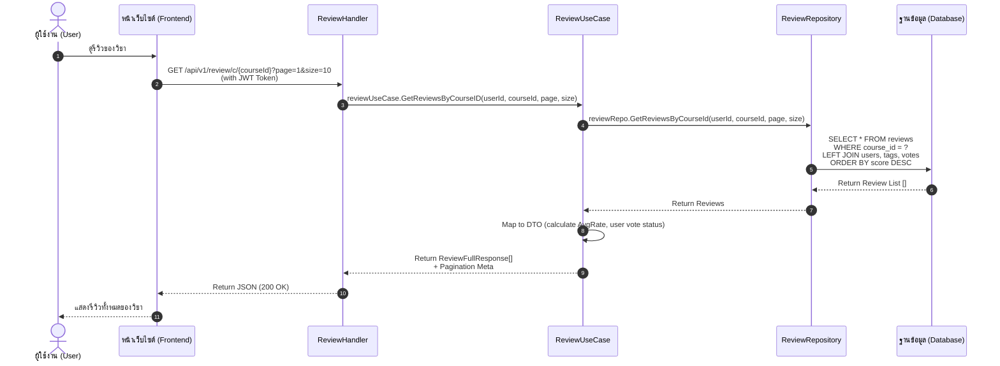

---

## 7. Review Flow - Create Review
**หน้าบ้าน:** Course Detail Page

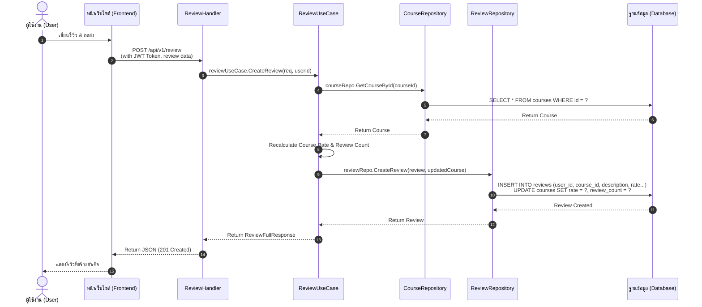

---

## 8. Vote Flow - Vote Review
**หน้าบ้าน:** Course Detail Page

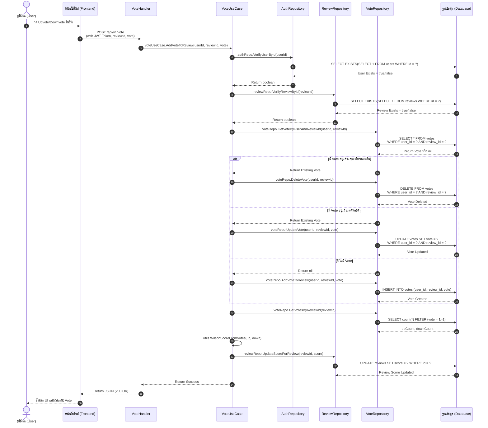

---

## 9. Professor Flow - Get All/One Professor

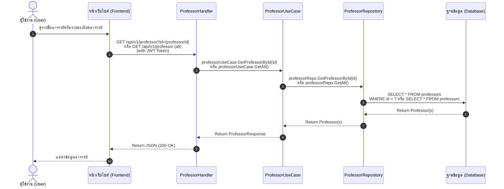

---

## 10. Tag Flow - Get All/One Tag

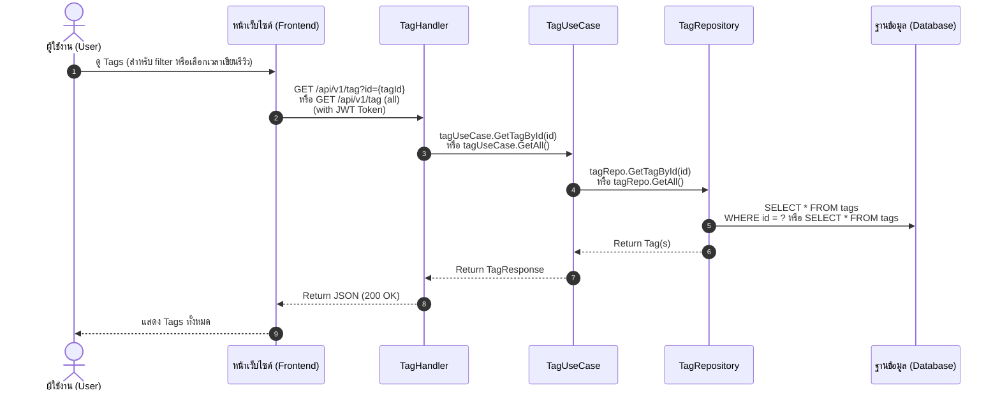

---

## 11. Report Flow - Create Report
**หน้าบ้าน:** Course Detail Page

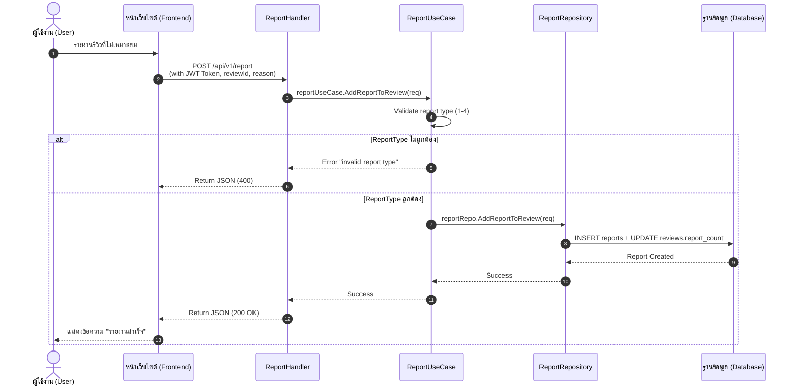

---

## 12. Admin Flow - Get All Reports
**หน้าบ้าน:** Admin Report Management Page

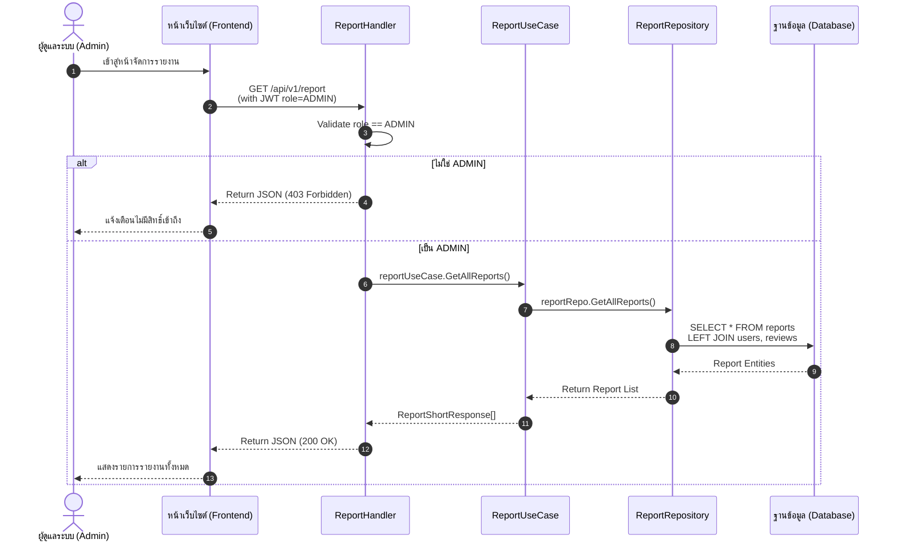

---

## 13. Admin Flow - Manage Report (Solve/Reject)
**หน้าบ้าน:** Admin Report Management Page

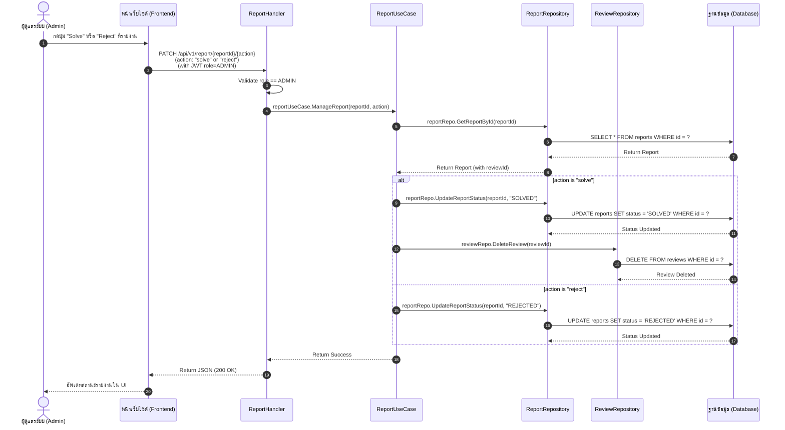
